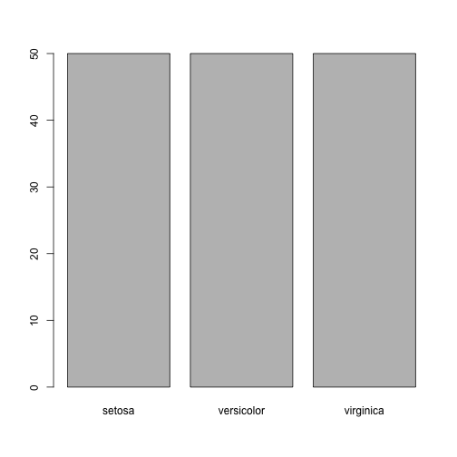
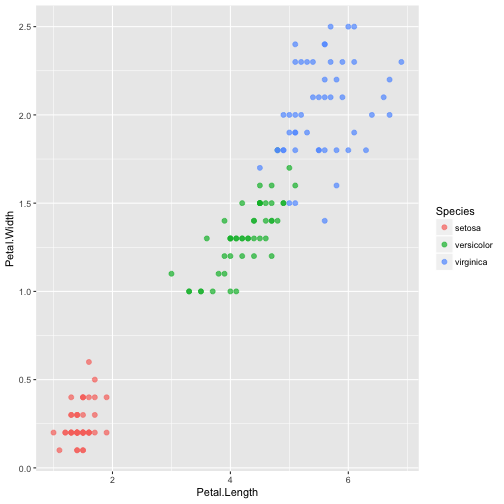
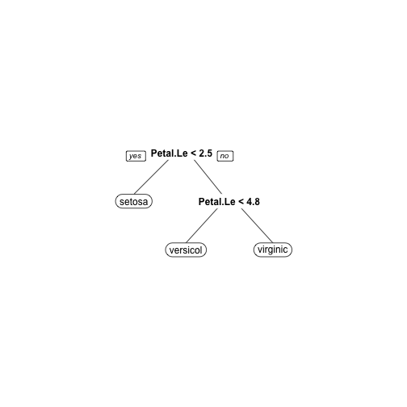

iris species predictor
========================================================
author: Xiaoyang Jin
date: 2017-02-13
autosize: true
font-family: 'Chalkboard'


About iris dataset
========================================================

> This famous (Fisher's or Anderson's) iris data set gives the measurements in centimeters of the variables sepal length and width and petal length and width, respectively, for 50 flowers from each of 3 species of iris. The species are _Iris setosa_, _versicolor_, and _virginica_.

***


```r
barplot(table(iris$Species))
```




Data viewer
========================================================



***

**Input control**

- `variable 1` (selectizeInput)
- `variable 2` (selectizeInput)
- `point size` (sliderInput)
- `color by species` (radioButtons)

**Output**

- scatter plot of iris data

Class predictor
========================================================



***

**Input control**

- `random seed`
- `training percentage`
- `cross-validation fold`
- `classification method`

**Output**

- `rpart` model plot
- confusion matrix on test set

Thanks
========================================================

run application demo at <https://jzsh2000.shinyapps.io/iris/>


